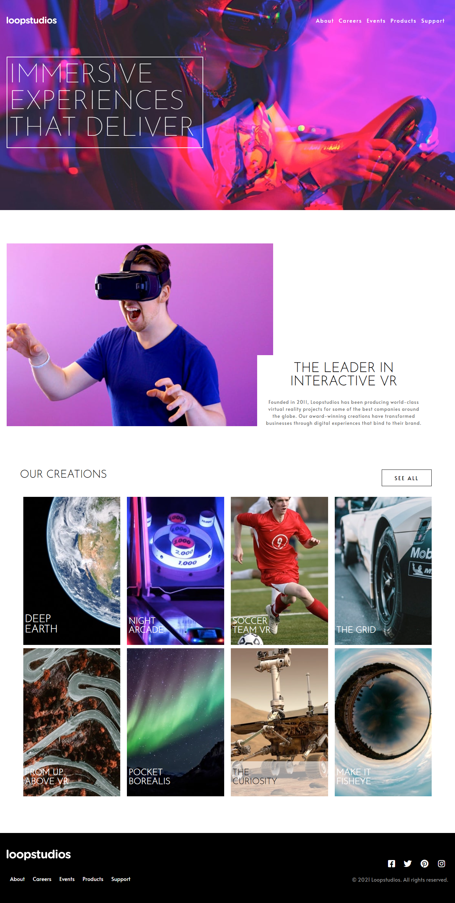

# Frontend Mentor - Loopstudios landing page solution

### The challenge

Users should be able to:

- View the optimal layout for the site depending on their device's screen size
- See hover states for all interactive elements on the page

### Screenshot

### Links

- Solution URL: [solution URL](frontendmentor.io/solutions/html-and-css-and-javascript-jAA-OC6wj)
- Live Site URL: [live site URL](https://loopstudio-landingpage.netlify.app/)

### Built with

- Semantic HTML5 markup
- CSS custom properties
- Flexbox
- Mobile-first workflow
- Javascript
## Author

- Website - [Mohamed Hesham]
- Frontend Mentor - [@mohamdhesham221](https://www.frontendmentor.io/profile/mohamedhesham221)
- Linkedin - [Mohamed Hesham](https://www.linkedin.com/in/mohamed-hesham-b7611618a/)
